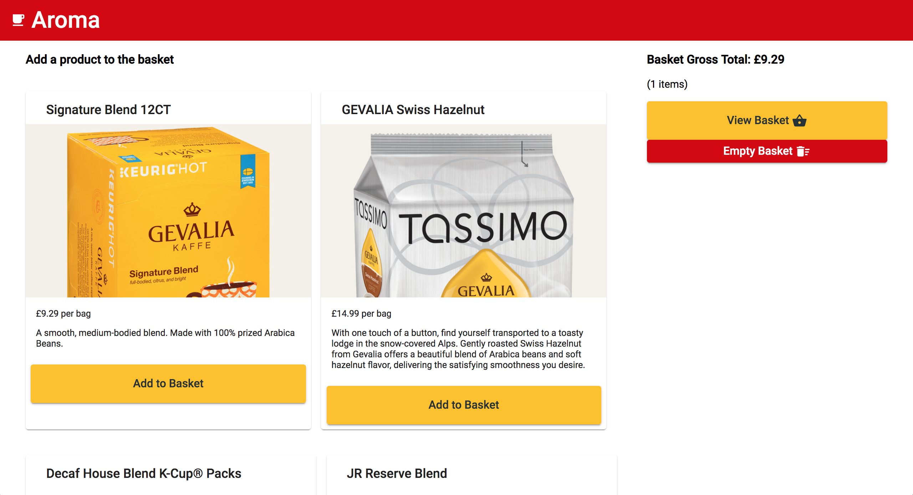

# Angular RxJS Shopping Basket (multi-currency)

Angular 8 shopping basket app. 
- Generated with [Angular CLI](https://github.com/angular/angular-cli) version 8.2.0.
- RxJS Observables
- Immutable basket. Local storage of basket contents
- API call for exchange rates, with error handler  
- Calls exchange rates API for multi-currency option
- Google Material and Font Awesome styling. SCSS
- Unit tests: Karma (runner), Jasmine (framework), SinonJS (mocking), e2e

## Development server

Run `ng serve` for a dev server. Navigate to `http://localhost:4200/`. The app will automatically reload if you change any of the source files.

## Home

## /basket

# Tests

## Running unit tests

Run `ng test` to execute the unit tests via [Karma](https://karma-runner.github.io).

3 specs have no expectations; I need to study 'sinon' more. Also there is regards polyfills.js:3296 an "Uncaught TypeError: Right-hand side of 'instanceof' is not callable"

## Unit test details

37 specs, 0 failures

BasketService  
- should be injectable  

get()  
- should be value 0 on basket.grossTotal  
- should return an Observable<Basket>  
- should be value 0 on basket.items  
- should return a populated Basket model instance when the Observable is subscribed to  
- should be value 0 on basket.itemsTotal  
- should return a Basket model instance when the Observable is subscribed to  

empty()  
- SPEC HAS NO EXPECTATIONS should create empty basket and persist  

addItem()  
- should add the item to the basket and persist  
- should dispatch basket  
- should set the correct quantity on products already added to the basket  
- totals calculation  
- should calculate the shopping basket totals correctly  

DataService  
- should be injectable  
- should receive Products data > 0  
- should be created  
- should call the Exchange Rates data  
- should call the Products data  

AppComponent  
- should have as title 'shopping-basket-multi-currency'  
- should create the app  
- should render title in a span tag  

BasketComponent  
- should display basket's gross total  
- should render "Empty Basket" in a button tag  
- should render "Continue Shopping" in a button tag  
- should render "Basket Gross Total" in a h3 tag  
- should empty basket upon click on the empty basket button  
- SPEC HAS NO EXPECTATIONS should remove product from basket upon click on remove item button  
- should create  

ProductsComponent  
- should display all products - count: expect 3  
- should render "Empty Basket" in a button tag  
- should render "View Basket" in a button tag  
- should render "Add to Basket" in a button tag  
- SPEC HAS NO EXPECTATIONS should add product to basket upon click on add item button  
- should display all products - check content: name, price  
- should create  
- should render "Add a product" in a h3 tag  

StorageService  
- should be created  

CachingService  
- should be created  

## Running end-to-end tests

Run `ng e2e` to execute the end-to-end tests via [Protractor](http://www.protractortest.org/).

# Build / Extend

## Build

Run `ng build` to build the project. The build artifacts will be stored in the `dist/` directory. Use the `--prod` flag for a production build.

## Code scaffolding

Run `ng generate component component-name` to generate a new component. You can also use `ng generate directive|pipe|service|class|guard|interface|enum|module`.

# Further help

To get more help on the Angular CLI use `ng help` or go check out the [Angular CLI README](https://github.com/angular/angular-cli/blob/master/README.md).
